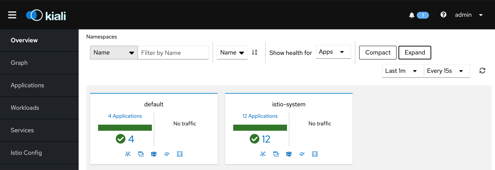

###什么是Istio

istio是一个开源的实现了服务网格的平台，基于k8s平台，具有负载均衡、服务间认证、监控等功能，为业务应用服务。

### 安装Istio

- 通过istioctl 安装

  curl -L https://istio.io/downloadIstio | ISTIO_VERSION=1.5.1 sh 下载

  istioctl profile list 查看安装规则一般选择 demo，istioctl manifest apply --set profile=demo

  你能够看到很多服务组件都是安装在 namespace istio-system下

  查看安装的服务 `kubectl get svc -n istio-system `

###安装kiali

- 修改kiali

  `kubectl edit svc kiali -n istio-system`

  将type: clustIP 改为 type: NodePort,这样更好测试访问

- 给kiali添加密码，其实就是给kilia service挂载一个Secret

  ```shell
  USERNAME=$(echo -n 'admin' | base64)
  PASSPHRASE=$(echo -n 'admin' | base64)
  NAMESPACE=istio-system
  kubectl create namespace $NAMESPACE
  cat <<EOF | kubectl apply -f -
  apiVersion: v1
  kind: Secret
  metadata:
    name: kiali
    namespace: $NAMESPACE
    labels:
      app: kiali
  type: Opaque
  data:
    username: $USERNAME
    passphrase: $PASSPHRASE
  EOF
  ```

- 查看kiali映射在宿主机的端口

  `k describe svc kiali -n istio-system` 找到 NodePort（这个端口号是变换的）

  ```shell
  NodePort:                 http-kiali  30717/TCP
  ```

  接下来访问kiali: http://本机ip:30717/ ，效果如下：

  

### 安装应用 bookinfo

这是一个 istio的应用范例

- 我们在默认的namespace下创建我们的应用, 给default添加标签

  `kubectl label namespace default istio-injection=enabled`

- 到istio的安装包下安装bookinfo的应用

  `kubectl apply -f samples/bookinfo/platform/kube/bookinfo.yaml`

  这些应用安装在default下：`kubectl get pods`

  

- 安装bookinfo-gateway

  `kubectl apply -f samples/bookinfo/networking/bookinfo-gateway.yaml`

  查看安装： `kubectl get gateway`

  查看网关：`kubectl get svc istio-ingressgateway -n istio-system`

  

  其中 80:30833对应的就是的外网访问端口

  访问bookinfo http://本机IP:30833/productpage

  

  

- 在kiali中你能看到每个应用的调用关系

  istio-kiali-bookinfo

  

### 扩展 bookinfo

在简单的搭建好一个服务网格的系统之后，我们接下来就主要关注于在这个网格里，是如何上线一个应用的

- 结构图

- 首先实现外部请求访问服务网格的应用，本质就是实现外部访问k8s，在上述例子中使用的其实是Istio部署的LoadBalancer服务

  执行`kubectl get svc -n istio-system -l istio=ingressgateway -o yaml`查看这个服务详情

  ```yaml
  apiVersion: v1
  items:
  - apiVersion: v1
    kind: Service
    metadata:
    	...
    spec:
      clusterIP: 10.96.121.156
      externalTrafficPolicy: Cluster
      ports:
      - name: status-port
        nodePort: 32362
        port: 15020
        protocol: TCP
        targetPort: 15020
      - name: http2
        nodePort: 30833
        port: 80
        protocol: TCP
        targetPort: 80
      ...
      selector:
        app: istio-ingressgateway
  ```

  在selector中，它指定了一个标签为`app=istio-ingressgateway`的pod，也就是说所有发送给这个loadblance服务的请求，都会被发送到这个pod，且对外的端口`30833`对应的是pod的端口`80`

  找到这个pod`kubectl get pods -l app=istio-ingressgateway -n istio-system`

  ```shell
  你好,欢迎使用kubectl
  NAME                                    READY   STATUS    RESTARTS   AGE
  istio-ingressgateway-649f9646d4-m2cz2   1/1     Running   0          5d2h
  ```

  而这个pod则是通过一个叫 `istio-ingressgateway`的deployment（具有k8s rc的所有特性，还能进行版本控制）进行管理

- 我们已经知道了外界与服务网格间通信是通过一个叫 istio-ingressgateway 的 LoadBlance 服务实现的，那从LB到我们的应用`productpage`又是怎么走的呢

  回顾之前，我们在namepspace为`default`下创建bookinfo应用时，也创建了一个`bookinfo-gateway`的gateway资源, 显而易见，这个bookiinfo-gateway就是控制着任何要进入我们的应用的请求

  查看`bookiinfo-gateway`:`kubectl get gw bookinfo-gateway -o yaml`

  ```yaml
  apiVersion: networking.istio.io/v1alpha3
  kind: Gateway
  metadata:
  	...
  spec:
    selector:
      istio: ingressgateway
    servers:
    - hosts:
      - '*'
      port:
        name: http
        number: 80
        protocol: HTTP
  ```

  整个定义内容的意思：所有符合标签 `istio=ingressgateway`的pod将去监听 80 端口，且接受来自所有主机的请求

  我们来看看是这个Gateway作用在哪个pod上，其实这里涉及到一个问题，我们实际去查看的时候，在namespace为 `default`下是没有标签为这个的pod，反而在istio-system下存在这个pod

  `kubectl get pods -l istio=ingressgateway -n istio-system` 

  ```shell
  你好,欢迎使用kubectl
  NAME                                    READY   STATUS    RESTARTS   AGE
  istio-ingressgateway-649f9646d4-m2cz2   1/1     Running   0          5d4h
  ```

  

  且这个pod就是我们上面说的LB服务转发的pod，也就是通过deployment创建生成的那个pod，且这个pod是跨命名空间的，也就说虽然bookinfo的`bookinfo-gateway`和我们的deployment `istio-ingressgateway`不在一个namespace，但在`default`下的`bookinfo-gateway`还是能够作用到`istio-ingressgateway`上。

  当我们没有启动bookinfo应用时，进入到这个`istio-ingressgateway`的pod，查看端口监听情况，是没有找到80端口被监听，但当我们启动了bookinfo的`bookinfo-gateway`就能很快发现多了一个监听端口 80。

  到此我们已经能够从k8s集群之外(也就是 istio 框架外)访问到我们的服务网格的网关`istio-ingressgateway`,通过网关又能找到我们应用网关`bookinfo-gateway`

- 

  


